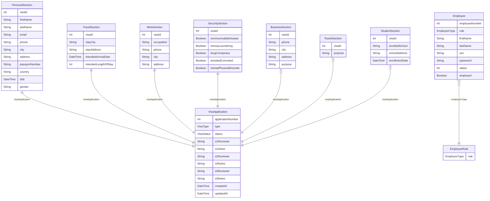

```mermaid
erDiagram

VisaApplication {
Int applicationNumber
VisaType type
VisaStatus status
String s1Reviewer
String s1Notes
String s2Reviewer
String s2Notes
String s3Reviewer
String s3Notes
DateTime createdAt
DateTime updatedAt
}

PersonalSection {
Int visaId
String firstName
String lastName
String email
String phone
String city
String address
String passportNumber
String country
DateTime dob
String gender
}

TravelSection {
Int visaId
String stayCity
String stayAddress
DateTime intendedArrivalDate
Int intendedLengthOfStay
}

WorkSection {
Int visaId
String occupation
String phone
String city
String address
}

SecuritySection {
Int visaId
Boolean communicableDisease
Boolean moneyLaundering
Boolean drugConspiracy
Boolean arrestedConvicted
Boolean mentalPhysicalDisorder
}

BusinessSection {
Int visaId
String phone
String city
String address
String purpose
}

TouristSection {
Int visaId
String purpose
}

StudentSection {
Int visaId
String enrolledSchool
String schoolAddress
DateTime enrollmentDate
}

EmployeeRole {
EmployeeType role
}

Employee {
Int employeeNumber
EmployeeType role
String firstName
String lastName
String ssn
String password
Int salary
Boolean employed
}

PersonalSection ||--|| VisaApplication : "visaApplication"
TravelSection ||--|| VisaApplication : "visaApplication"
WorkSection ||--|| VisaApplication : "visaApplication"
SecuritySection ||--|| VisaApplication : "visaApplication"
BusinessSection o|--|| VisaApplication : "visaApplication"
TouristSection o|--|| VisaApplication : "visaApplication"
StudentSection o|--|| VisaApplication : "visaApplication"

Employee o{--|| EmployeeRole : "employeeType"

```
